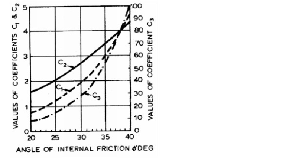

Lateral soil models
===================

The following lateral models are included in openpile. 

* :ref:`API-lat-sand`
* :ref:`API-lat-clay`
* :ref:`Dunkirk-sand`
* :ref:`Cowden-clay`

.. %%%%%%%%%%%%%%%%%%%%%%%%%%%%%%%%%%%%%%%%%%%%%%
.. _API-lat-sand:

API sand
--------

The API sand soil model is based on the publication by 
O'neill and Murchison, preceded by work from Reese, L.C. and others (
see [MuOn83]_ and [MuOn84]_). 

OpenPile's use of this model is done by calling the following class in a layer:

* :py:class:`openpile.soilmodels.API_sand`

This soil model provides soil springs as given by the function(s):

* :py:func:`openpile.utils.py_curves.api_sand`

p-y formulation
^^^^^^^^^^^^^^^

The API sand formulation is presented in both the API and DNVGL standards,
see, [DNV-RP-C212]_ and [API2000]_.

Granular soils are modelled by the sand p-y model as described 
with the following backbone formula:

.. math::

    p = A \cdot P_{max} \cdot \tanh \left( \frac{k \cdot X}{A \cdot P_{max} }  y \right) 

where:

* :math:`A` is a factor to account for static of cyclic loading 
* :math:`P_{max}` is the ultimate resistance of the p-y curve 
* :math:`k` is the initial modulus of subgrade reaction
* :math:`X` is the depth below mudline of the p-y curve.

Factor A
^^^^^^^^

The factor A takes into account whether the curve represent 
static(also called monotonic) or cycling loading and is equal to:

.. math::

    A = 
    \begin{cases} 
    \begin{split}
    0.9 & \text{  for cyclic loading} \\ 
    \\
    3 - 0.8 \frac{X}{D} \ge 0.9 & \text{  for static loading}
        \end{split}
      \end{cases}

where:

* :math:`D` is the pile diameter. 
 
Initial subgrade reaction
^^^^^^^^^^^^^^^^^^^^^^^^^

The factor k is the initial modulus of subgrade reaction, which can be 
approximated by the following equation in which the output is given in kN/m³ 
and where :math:`\phi` is inserted in degrees: 

.. math::

    k = 
    \begin{cases} 
    \begin{split}
    197.8 \cdot \phi^2 - 10232 \cdot \phi + 136820 \ge 5400 & \text{ ,  below water table} \\ 
    \\
    215.3 \cdot \phi^2 - 8232 \cdot \phi + 63657 \ge 5400  & \text{ ,  above water table}
    \end{split}
    \end{cases}

The equation is a fit to the recommended values in [DNV-RP-C212]_.  The correspondence 
of this fit is illustrated in below figure:

.. figure:: /_static/py_API_sand/k_vs_phi.jpg
    :width: 80%

    Subgrade reaction moduli fits calculated by openpile.

Ultimate resistance
^^^^^^^^^^^^^^^^^^^

The ultimate resistance :math:`P_{max}` is calculated via the coefficients C1, C2 and C3 found 
in the below figure. 

    Coefficients to calculate the maximum resistance. (as given in [MuOn84]_) 

The Ultimate resistance is found via the below equation:

.. math::

    P_{max} = \left( 
         C1 \cdot \sigma^{\prime} \cdot X + C2 \cdot \sigma^{\prime} \cdot D \right) \lt
         C3 \cdot \sigma^{\prime} \cdot D 

where:

* :math:`\sigma^{\prime}` is the vertical effective stress

.. %%%%%%%%%%%%%%%%%%%%%%%%%%%%%%%%%%%%%%%%%%%%%%
.. _API-lat-clay:

API clay
--------

The lateral soil model called API clay is based on the work conducted by Matlock (1970) (see [Matl70]_).  

OpenPile's use of this model is done by calling the following class in a layer:

* :py:class:`openpile.soilmodels.API_clay`

This soil model provides soil springs as given by the function(s):

* :py:func:`openpile.utils.py_curves.api_clay`

The p-y clay formulation is presented in both the API and DNVGL standards,
see [DNV-RP-C212]_ and [API2000]_. 

.. note::
    From an undrained shear strength of 96 kPa (assumed as the threshold at which a clay is considered stiff), 
    the formulations are adjusted to account for a more brittle fracture and degradation 
    of the soil, and the *"modified Matlock approach"* is used, see [BaCA06]_.

    This value of 96 kPa can be changed by the user via the argument `stiff_clay_threshold`.
    Hence, if one would not want to include the *"modified Matlock approach"*, 
    one could simply increase this threshold to a very large value.

.. figure:: _static/schematic_curves.png
    :width: 80%

    Schematic of soft and stiff clay response, after [BaCA06]_.

Ultimate resistance 
^^^^^^^^^^^^^^^^^^^

The utlimate resistance is calculated via the capacity of two failure mechanisms,
one that is shallow (wedge-type failure) and another that is deep (flow-around failure).

.. math::

    P_{max} &= min(P_{shallow}, P_{deep})
    \\\\
    P_{shallow} &= D (3 S_u \cdot \sigma^{\prime}) + J \cdot S_u \cdot X
    \\\\
    P_{deep} &=  9 \cdot S_u \cdot X

where: 

* :math:`S_u` is the undrained shear strength in Unconfined and 
  unconsolidated (UU) Trixial tests.
* :math:`\sigma^{\prime}` is the vertical effective stress.
* :math:`J` is an empirical factor determined by Matlock to fit results 
  to pile load tests. This value can vary from 0.25 to 0.50 depending on 
  the clay characteristics
* :math:`X` is the depth below ground level

Strain normalization
^^^^^^^^^^^^^^^^^^^^

A normalization parameter :math:`y_{50}` is used to scale the curve with respect
to the structure's scale.

.. math::

    y_{50} = 2.5 \cdot \varepsilon_{50} \cdot D

where: 

* :math:`D` is the pile width or diameter
* :math:`\varepsilon_{50}` is the strain at 50% ultimate resistance
  in Unconfined and unconsolidated (UU) Trixial tests.

Transition zone
^^^^^^^^^^^^^^^

The transition zone corresponds to the depth at which the failure 
around the pile is not governed by the free-field boundary, i.e. the ground level.
Below the transition zone, a flow-around type of failure.

The transition zone is defined by the following formula:

.. math::

    X_R = \left( \frac{6 \cdot D}{\gamma^{\prime} \cdot \frac{D}{S_u} + J} \right) \ge  2.5 \cdot D

Initial stiffness
^^^^^^^^^^^^^^^^^

The initial slope :math:`k_{ini}` is calculated as per [DNV-RP-C212]_:  

.. math::

    k_{ini} = \dfrac{0.23 P_{max}}{0.1 y_{50}}

p-y formulation (static loading, Neq = 1)
^^^^^^^^^^^^^^^^^^^^^^^^^^^^^^^^^^^^^^^^^

Soft cohesive soils are modelled by the soft clay p-y model, 
generated using the following formula for static loading: 

.. math::

    p = 
    \begin{cases} 
    \begin{split}
    0.5 \cdot P_{max} \left( \frac{y}{y_{50}} \right)^{0.33} & \text{  for } y \le 8 y_{50} \\ 
    \\
    P_{max} & \text{  for } y \gt 8 y_{50}
    \end{split}
    \end{cases}  

p-y formulation (cyclic loading, Neq > 1)
^^^^^^^^^^^^^^^^^^^^^^^^^^^^^^^^^^^^^^^^^

For cyclic loading and curves below the transition zone ( i.e. :math:`X \ge Xr`), 
the p-y curve can be generated according to: 

.. math::

    p = 
    \begin{cases} 
    \begin{split}
    0.5 \cdot P_{max} \left( \frac{y}{y_{50}} \right)^{0.33} & \text{  for } y \le 3 y_{50} \\ 
    \\
    0.72 \cdot P_{max} & \text{  for } y \gt 3 y_{50}
    \end{split}
    \end{cases}  

For cyclic loading and curves above the transition zone ( i.e. :math:`X \le Xr`), 
the p-y curve can be generated according to: 

.. math::

    p = 
    \begin{cases} 
    \begin{split}
    0.5 \cdot P_{max} \left( \frac{y}{y_{50}} \right) & \text{  for } y \le 3 y_{50} \\ 
    \\
    0.72 \cdot P_{max} \left[ 1 - \left( 1 - \frac{X}{X_R} \right) \left( \frac{y - 3 y_{50}}{12 y_{50}} \right)  \right] & \text{  for } 3 y_{50} \lt y \le 15 y_{50} \\
    \\
    0.72 \cdot P_{max} \left( \frac{X}{X_R} \right) & \text{  for } y \gt 15 y_{50} \\
    \end{split}
    \end{cases}  

.. _Dunkirk-sand:

Dunkirk-sand (PISA model)
-------------------------

.. _Cowden-clay:

Cowden-clay (PISA model)
------------------------