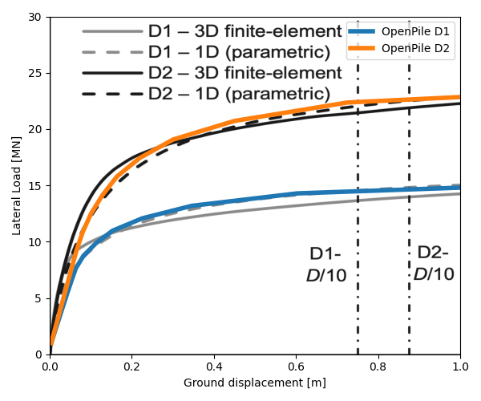

Lateral soil models
===================

.. _Dunkirk-sand:

Dunkirk-sand (PISA model)
-------------------------

OpenPile's use of this model is done by calling the following class in a layer:

* :py:class:`openpile.soilmodels.Dunkirk_sand`

This soil model provides soil springs as given by the function(s):

* :py:func:`openpile.utils.py_curves.dunkirk_sand`
* :py:func:`openpile.utils.mt_curves.dunkirk_sand`
* :py:func:`openpile.utils.Hb_curves.dunkirk_sand`
* :py:func:`openpile.utils.Mb_curves.dunkirk_sand`

.. note::
    This standard model only account for monotonic reaction curves and as usual, it reflects the site conditions of the site the curves were calibrated from, a site in Dunkirk, France where dense sand is found. 
    More details can be found in [BTZA20]_.

This soil model was formulated as part of the Joint Industry Project PISA, that focused on formulating soil springs for large diameter monopiles as found in the offshore wind industry. 
This resulted in soil springs formulated in a normalized space based on a conic function backbone curve and the few following soil parameters, 
(i) relative density and (ii) small-strain shear stiffness. 

Validation is shown in the below figure by performing a benchmark of OpenPile
against the source material, [BTZA20]_. OpenPile shows some differences in result for high lateral load. 
This is due to the lack of clearer guidance for the use of small-strain shear stiffness in calculations found in the source material.

    Validation against pile D2t documented in [BTZA20]_.

.. _Cowden-clay:

Cowden-clay (PISA model)
------------------------

This soil model was formulated as part of the Joint Industry Project PISA, that focused on formulating soil springs for large diameter monopiles as found in the offshore wind industry. 
This resulted in soil springs formulated in a normalized space based on a conic function backbone curve and the few following soil parameters, 
(i) undrained shear strength and (ii) small-strain shear stiffness. 

OpenPile's use of this model is done by calling the following class in a layer:

* :py:class:`openpile.soilmodels.Cowden_clay`

This soil model provides soil springs as given by the function(s):

* :py:func:`openpile.utils.py_curves.cowden_clay`
* :py:func:`openpile.utils.mt_curves.cowden_clay`
* :py:func:`openpile.utils.Hb_curves.cowden_clay`
* :py:func:`openpile.utils.Mb_curves.cowden_clay`

.. note::
    This standard model only account for monotonic reaction curves and as usual, it reflects the site conditions of the site the curves were calibrated from, a site in Cowden, England where overconsolidated glacial till is found. 
    More details can be found in [BHBG20]_.

The model is validated in the below figure by performing a benchmark of OpenPile
against the source material, [BHBG20]_.

    Validation against piles D1 and D2 documented in [BHBG20]_.

.. _Reese-weakrock:

Reese weak rock 
---------------

OpenPile's use of this model is done by calling the following class in a layer:

* :py:class:`openpile.soilmodels.Reese_weakrock`

This soil model provides soil springs as given by the function(s):

* :py:func:`openpile.utils.py_curves.reese_weakrock`
* :py:func:`openpile.utils.mt_curves.reese_weakrock`
* :py:func:`openpile.utils.Hb_curves.reese_weakrock`
* :py:func:`openpile.utils.Mb_curves.reese_weakrock`

This soil model is based on [Rees97]_ and can be used for rock. 
This empirical model is mostly based on experimental data of pile load tests near San Francisco
where the rock unconfined compressive strength varies from 1.86 MPa near the surface to 16.0 MPa.

Pressuremeter tests results were used by Reese in this formulation as the initial modulus of the rock. 

