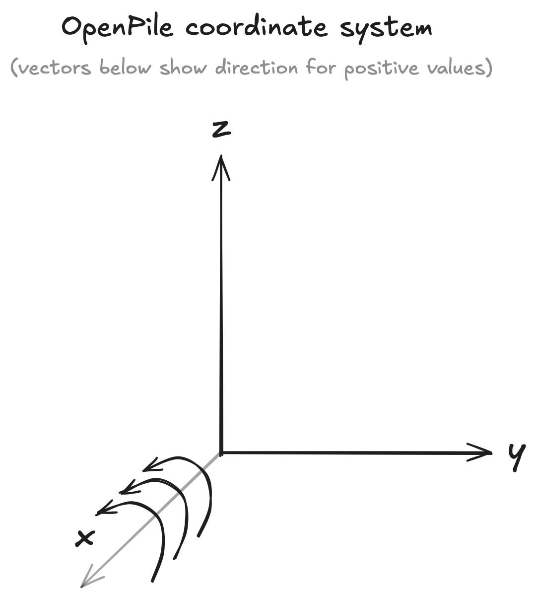

Philosophy
==========

these calculations can be as simple/generic as it gets, e.g. calculating the weight of a beam, its volume, or perform more advanced calculations with 1D Finite Element Method.

Overall structure/principle
===========================

*pending...*

.. show a plot of the beam/pile 

.. ref to objects in API.

System of units
===============

The unit system used in this library is the `International System of Units (SI) <https://en.wikipedia.org/wiki/International_System_of_Units>`_. 
The primary units used in OpenPile are kN (kilonewton) and m (meter). 
The documentation (e.g. docstrings) should inform the user just well enough. If there is any ambiguity, 
please create an issue so that we can solve this.

Coordinates System
==================

The coordinate system in OpenPile follows right hand system as shown below:

    Coordinates system followed in OpenPile.

