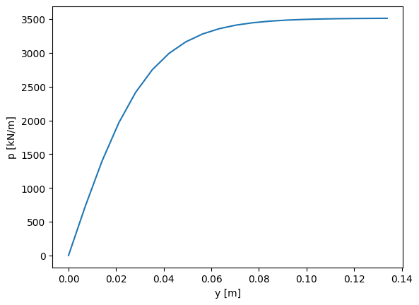
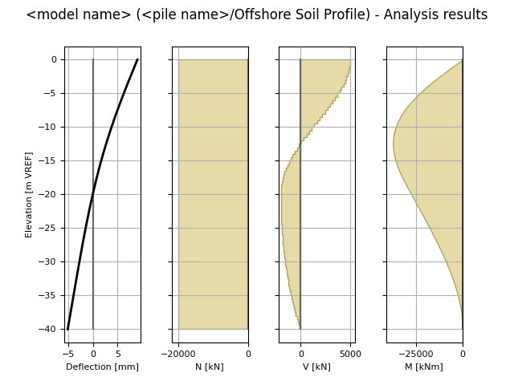

-----
Usage
-----

The package allows a quick input by the user (given in this section) and quick calculation. 

Jupyter Notebooks/IPython are recommended platforms to learn how to use openpile as it provides 
an interactive experience. 

.. _Ex1-create_a_pile:

Example 1 - Create a pile 
=========================

A pile can be created in the following way in openpile. It is strongly advised to use 
the :py:meth:`openpile.construct.Pile.create` constructor to ensure that data validation and post-processing of the object is performed.

.. code-block:: python

    from openpile.construct import Pile

    # Create a pile instance with two sections of respectively 10m and 30m length.
    pile = Pile.create(name = "",
            kind='Circular',
            material='Steel',
            top_elevation = 0,
            pile_sections={
                'length':[10,30],
                'diameter':[7.5,7.5],
                'wall thickness':[0.07, 0.08],
            }
        )

Once the pile (object) is created, the user can use its properties and methods to interact with it. 
A simple view of the pile can be extracted by printing the object as below: 

.. code-block:: python
    
    # Print the pile data
    print(pile)
        Elevation [m]  Diameter [m]  Wall thickness [m]  Area [m2]     I [m4]
    0            0.0           7.5                0.07   1.633942  11.276204
    1          -10.0           7.5                0.07   1.633942  11.276204
    2          -10.0           7.5                0.08   1.864849  12.835479
    3          -40.0           7.5                0.08   1.864849  12.835479

The user can also extract easily the pile's length, its elevations and other properties.
Please see the :py:class:`openpile.construct.Pile`

As of now, only a circular pile can be modelled in openpile, however the user can bypass 
the construcutor by updating the pile's properties governing the pile's behaviour under 
axial or lateral loading.

.. code-block:: python

    # Override young's modulus
    pile.E = 250e6
    # Check young's modulus (value in kPa)
    print(pile.E)
    250000000.0
    # Override second moment of area across whole pile [in meters^4]
    pile.I = 1.11
    # Check updated second moment of area
    print(pile)
        Elevation [m]  Diameter [m] Wall thickness [m] Area [m2]  I [m4]
    0            0.0           7.5               <NA>  1.633942    1.11
    1          -10.0           7.5               <NA>  1.633942    1.11
    2          -10.0           7.5               <NA>  1.864849    1.11
    3          -40.0           7.5               <NA>  1.864849    1.11
    # Override pile's width or pile's diameter [in meters]
    pile.width = 2.22
    # Check updated width or diameter
    print(pile)
        Elevation [m]  Diameter [m] Wall thickness [m] Area [m2]  I [m4]
    0            0.0          2.22               <NA>  1.633942    1.11
    1          -10.0          2.22               <NA>  1.633942    1.11
    2          -10.0          2.22               <NA>  1.864849    1.11
    3          -40.0          2.22               <NA>  1.864849    1.11
    # Override pile's area  [in meters^2]
    pile.area = 1.0
    # Check updated width or diameter
    print(pile)
        Elevation [m]  Diameter [m] Wall thickness [m] Area [m2]  I [m4]
    0            0.0          2.22               <NA>       1.0    1.11
    1          -10.0          2.22               <NA>       1.0    1.11
    2          -10.0          2.22               <NA>       1.0    1.11
    3          -40.0          2.22               <NA>       1.0    1.11

.. _Ex2-plot_a_pycurve:

Example 2 - Calculate and plot a p-y curve 
==========================================

openpile allows for quick access to soil curves. The below example shows
how one can quickly calculate a soil spring at a given elevation and plot it.

The different curves available can be found in:

* :py:mod:`openpile.utils.py_curves`
* :py:mod:`openpile.utils.mt_curves`
* :py:mod:`openpile.utils.tz_curves`

Here below is an example of a quick check of how a static curve for the 
API sand model looks like.

.. code-block:: python
    
    import matplotlib.pyplot as plt
    from openpile.utils.py_curves import api_sand

    p, y = api_sand(sig=50, # vertical stress in kPa 
                    X = 5, # depth in meter
                    phi = 35, # internal angle of friction 
                    D = 5, # the pile diameter
                    below_water_table=True, # use initial subgrade modulus under water
                    Neq=1, # static curve
                    )

    plt.plot(y,p)
    plt.ylabel('p [kN/m/m]')
    plt.xlabel('y [m]')

.. _Ex3-create_a_layer:

Example 3 - Create a soil profile's layer 
=========================================

The creation of a layer can be done with the below lines of code. 
A Lateral and/or Axial soil model can be assigned to a layer.

.. code-block:: python

    from openpile.construct import Layer
    from openpile.soilmodels import API_clay
        
    # Create a layer
    layer1 = Layer(name='Soft Clay',
                top=0,
                bottom=-10,
                weight=18,
                lateral_model=API_clay(Su=[30,35], eps50=[0.01, 0.02], Neq=100), )

    print(layer1)

Printing the layer would give the following output:

.. code-block:: pycon
    
    Name: Soft Clay
    Elevation: (0.0) - (-10.0) m
    Weight: 18.0 kN/m3
    Lateral model: 	API clay
        Su = 30.0-35.0 kPa
        eps50 = 0.01-0.02
        Cyclic, N = 100 cycles
    Axial model: None

.. _Ex4-create_a_soilprofile:

Example 4 - Create a soil profile 
=================================

.. code-block:: python

    from openpile.construct import SoilProfile, Layer
    from openpile.soilmodels import API_sand, API_clay

    # Create a 40m deep offshore Soil Profile with a 15m water column
    sp = SoilProfile(
        name="Offshore Soil Profile",
        top_elevation=0,
        water_elevation=15,
        layers=[
            Layer(
                name='medium dense sand',
                top=0,
                bottom=-20,
                weight=18,
                lateral_model= API_sand(phi=33, Neq=100)
            ),
            Layer(
                name='firm clay',
                top=-20,
                bottom=-40,
                weight=18,
                lateral_model= API_clay(Su=[50, 70], eps50=0.015, Neq=100)
            ),
        ]
    )

    print(sp)

The output of the print out will yield the following:

.. code-block:: pycon

    Layer 1
    ------------------------------
    Name: medium dense sand
    Elevation: (0.0) - (-20.0) m
    Weight: 18.0 kN/m3
    Lateral model: 	API sand
        phi = 33.0°
        Cyclic, N = 100 cycles
    Axial model: None
    ~~~~~~~~~~~~~~~~~~~~~~~~~~~~~~
    Layer 2
    ------------------------------
    Name: firm clay
    Elevation: (-20.0) - (-40.0) m
    Weight: 18.0 kN/m3
    Lateral model: 	API clay
        Su = 50.0-70.0 kPa
        eps50 = 0.015
        Cyclic, N = 100 cycles
    Axial model: None
    ~~~~~~~~~~~~~~~~~~~~~~~~~~~~~~

.. _Ex5-run_winkler:

Example 5 - Create a Model and run an analysis 
==============================================

.. code-block:: python

    from openpile.construct import Pile, SoilProfile, Layer, Model
    from openpile.soilmodels import API_clay, API_sand

    # Create a pile instance with two sections of respectively 10m and 30m length.
    p = Pile.create(name = "",
            kind='Circular',
            material='Steel',
            top_elevation = 0,
            pile_sections={
                'length':[10,30],
                'diameter':[7.5,7.5],
                'wall thickness':[0.07, 0.08],
            }
        )

    # Create a 40m deep offshore Soil Profile with a 15m water column
    sp = SoilProfile(
        name="Offshore Soil Profile",
        top_elevation=0,
        water_elevation=15,
        layers=[
            Layer(
                name='medium dense sand',
                top=0,
                bottom=-20,
                weight=18,
                lateral_model= API_sand(phi=33, Neq=100)
            ),
            Layer(
                name='firm clay',
                top=-20,
                bottom=-40,
                weight=18,
                lateral_model= API_clay(Su=[50, 70], eps50=0.015, Neq=100)
            ),
        ]
    )

    # Create Model 
    M = Model.create(name="", pile=p, soil=sp)

    # Apply bottom fixity along x-axis 
    M.set_support(elevation=-40, Tx = True)
    # Apply axial and lateral loads
    M.set_pointload(elevation=0,Px=-20e3, Py = 5e3)

    # Run analysis
    from openpile.analyses import simple_winkler_analysis

    Result = simple_winkler_analysis(M)

    Result.plot()

